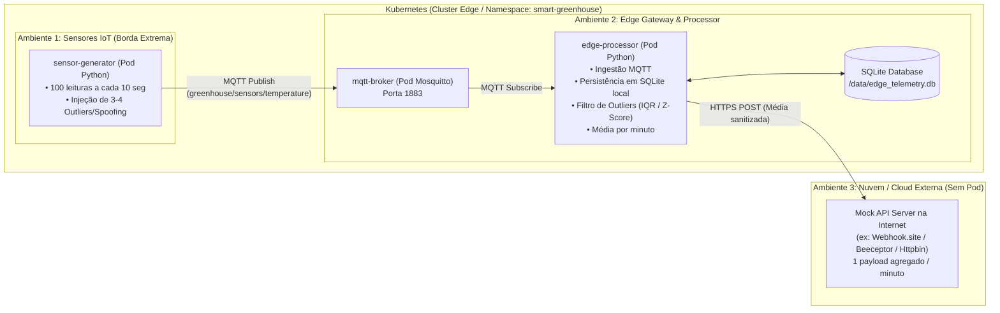

# 🌿 Laboratório: Segurança em Edge Computing (Estufa Inteligente no Kubernetes)

Bem-vindo ao repositório do laboratório prático de **Segurança em Edge Computing**. Este projeto simula uma **Estufa Inteligente (Smart Greenhouse)** utilizando **Kubernetes**, **MQTT**, **Processamento em Borda (Edge Computing)**, **Banco de Dados Local (SQLite)** e integração com **Nuvem (Cloud Mock API)**.

---

## 📐 1. Arquitetura da Solução



---

## 🎯 2. Objetivos Didáticos & Pilares de Segurança

Este laboratório foi desenhado especificamente para demonstrar em aula conceitos fundamentais de segurança aplicados à Borda (Edge):

| Pilar de Segurança | Como é demonstrado no Laboratório |
| :--- | :--- |
| **🛡️ Defesa contra Data Poisoning & Sensor Spoofing** | O gerador injeta 3 a 4 sensores adulterados (ex: -18°C ou 95°C). O **Edge Processor** detecta e expurga os dados anômalos antes de calcular a média. |
| **🔒 Minimização de Dados (Data Minimization & Privacidade)** | Das **600 leituras brutas por minuto**, todas ficam salvas localmente no SQLite da borda. Apenas **1 payload consolidado e sanitizado** sai para a Nuvem a cada minuto. |
| **🚧 Microsegmentação com Network Policies (K8s)** | Os pods dos sensores (`sensor-generator`) são proibidos de se comunicar com a internet ou outros pods, exceto a porta MQTT do broker. |
| **⚡ Resiliência e Continuidade Operacional (Offline Edge)** | Se o link com a nuvem cair, o processador continua operando localmente, armazenando tudo no SQLite e mantendo o controle da estufa. |
| **🔑 Controle de Acesso e Isolamento MQTT** | Sensores têm permissão apenas de publicação (*publish*), sem acesso a tópicos de comando ou leitura de outros nós. |

---

## 📦 3. Estrutura do Repositório

```
kubernetesEdgeComputing/
├── README.md                       # Este arquivo (Visão geral e plano)
├── docker-compose.yml              # Execução local rápida (Docker)
├── test_simulation.py              # Teste unitário do filtro de outliers e SQLite
├── sensor-generator/               # [Ambiente 1] Pod gerador de telemetria
│   ├── Dockerfile
│   ├── requirements.txt
│   └── sensor_sim.py
├── edge-processor/                 # [Ambiente 2] Pod processador de borda
│   ├── Dockerfile
│   ├── requirements.txt
│   └── processor.py
├── cloud-mock/                     # [Ambiente 3] Mock server local opcional
│   ├── Dockerfile
│   ├── requirements.txt
│   └── mock_server.py
├── k8s/                            # Manifestos de Kubernetes
│   ├── 00-namespace.yaml
│   ├── 01-storage.yaml
│   ├── 02-config.yaml
│   ├── 03-mqtt.yaml
│   ├── 04-edge-processor.yaml
│   ├── 05-sensor-generator.yaml
│   └── 06-network-policies.yaml
└── docs/
    └── GUIA_AULA.md                # Roteiro passo a passo para o professor
```

---

## 🚀 4. Guia de Início Rápido

### Opção A: Executar Localmente com Docker Compose (Testes Imediatos)

1. *(Opcional)* Se quiser testar na nuvem real, crie uma URL gratuita no [Webhook.site](https://webhook.site).
2. Execute o Docker Compose:
   ```bash
   docker compose up --build
   ```
3. Abra as **Interfaces Web Visuais** no navegador:
   - 🌿 **Dashboard do Edge Processor (Borda):** [http://localhost:5000](http://localhost:5000)
     - Acompanhe em tempo real o gráfico de dispersão com os outliers destacados em vermelho, os sensores flagrados por *data poisoning* e a tabela do SQLite.
   - ☁️ **Dashboard da Nuvem (Cloud Mock Datacenter):** [http://localhost:8088](http://localhost:8088)
     - Visualize os payloads consolidados de 1 minuto chegando na Nuvem com a economia de 99.83% de tráfego.

---

### Opção B: Executar no Kubernetes (Kind / Minikube / K3s / AKS / EKS)

1. Crie o namespace e os recursos:
   ```bash
   kubectl apply -f k8s/00-namespace.yaml
   kubectl apply -f k8s/01-storage.yaml
   kubectl apply -f k8s/02-config.yaml
   kubectl apply -f k8s/03-mqtt.yaml
   kubectl apply -f k8s/04-edge-processor.yaml
   kubectl apply -f k8s/05-sensor-generator.yaml
   kubectl apply -f k8s/06-network-policies.yaml
   ```

2. Acesse o Dashboard Web do Edge no Kubernetes via port-forward:
   ```bash
   kubectl port-forward -n smart-greenhouse svc/edge-processor 5000:5000
   # Abra no navegador: http://localhost:5000
   ```

3. Acompanhe os logs do processador de borda:
   ```bash
   kubectl logs -n smart-greenhouse -l app=edge-processor -f
   ```

3. Inspecione o banco SQLite dentro do pod do Edge Processor:
   ```bash
   kubectl exec -it -n smart-greenhouse deploy/edge-processor -- sqlite3 /data/edge_telemetry.db "SELECT * FROM minute_aggregates ORDER BY id DESC LIMIT 5;"
   ```

---

## 🎓 5. Material de Aula

Para o roteiro completo de apresentação, comandos de demonstração e perguntas reflexivas para os alunos, consulte o arquivo:
👉 [docs/GUIA_AULA.md](file:///c:/Users/henrique.poyatos/CodeProjects/kubernetesEdgeComputing/docs/GUIA_AULA.md)
